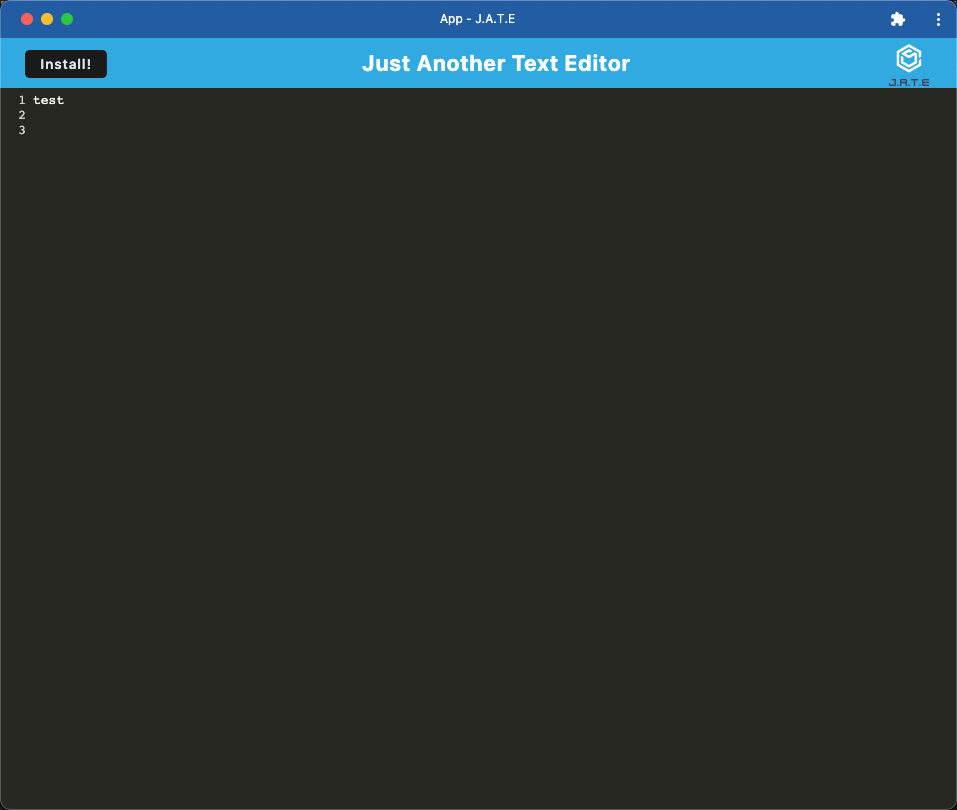
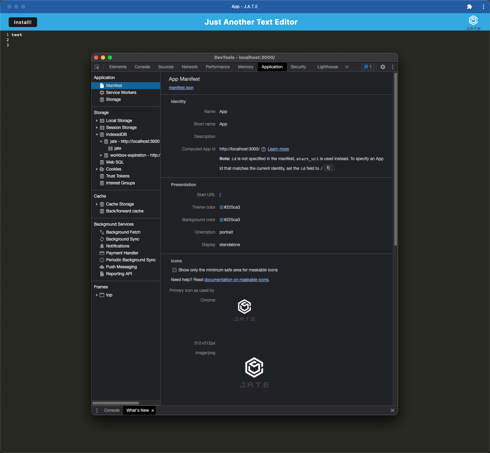
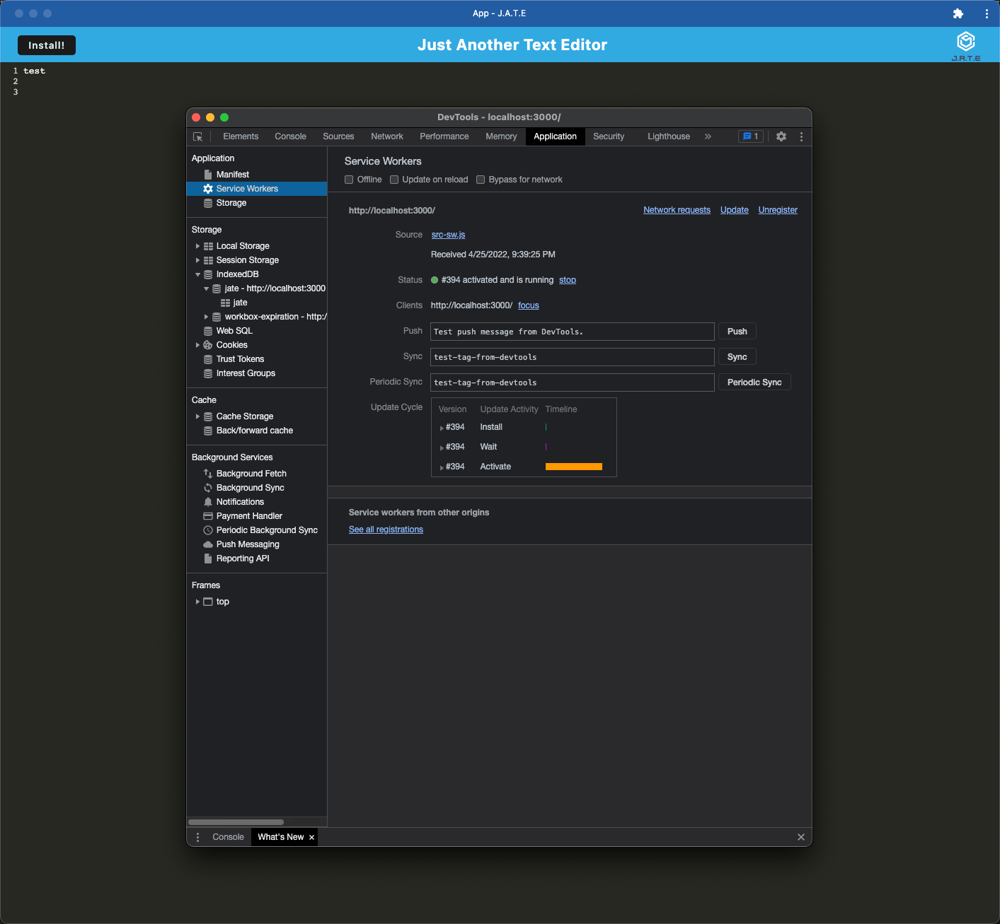
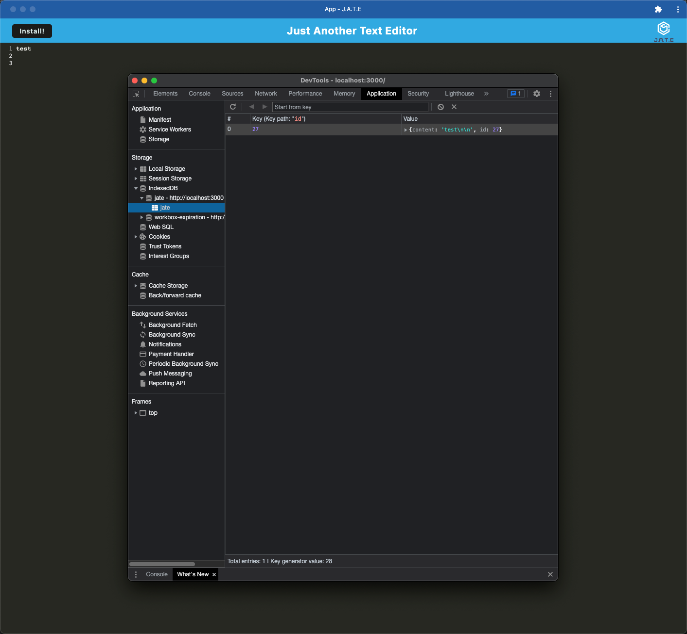

# Text-Editor-Web-App

## Description

This is a text editor that runs in a user's Internet browser. It was designed to save the notes entered into it so that upon closing and returning to this application (with our without an Internet connection), the user's notes would still remain on the page.

This text editor was also designed as a Progressive Web Application (PWA) so that the user could install it and save the application to their desktop.

## Screenshots of Application

## Technologies Used

This application utilizes these technologies:

* Webpack
* Babel
* Express

## Contact information

* Website: https://jaymoses01.github.io/hw-08-updated-portfolio-page/
* Email: JayRMoses@gmail.com

## MIT license

Permission is hereby granted, free of charge, to any person obtaining a copy
of this software and associated documentation files (the "Software"), to deal
in the Software without restriction, including without limitation the rights
to use, copy, modify, merge, publish, distribute, sublicense, and/or sell
copies of the Software, and to permit persons to whom the Software is
furnished to do so, subject to the following conditions:

The above copyright notice and this permission notice shall be included in all
copies or substantial portions of the Software.

THE SOFTWARE IS PROVIDED "AS IS", WITHOUT WARRANTY OF ANY KIND, EXPRESS OR
IMPLIED, INCLUDING BUT NOT LIMITED TO THE WARRANTIES OF MERCHANTABILITY,
FITNESS FOR A PARTICULAR PURPOSE AND NONINFRINGEMENT. IN NO EVENT SHALL THE
AUTHORS OR COPYRIGHT HOLDERS BE LIABLE FOR ANY CLAIM, DAMAGES OR OTHER
LIABILITY, WHETHER IN AN ACTION OF CONTRACT, TORT OR OTHERWISE, ARISING FROM,
OUT OF OR IN CONNECTION WITH THE SOFTWARE OR THE USE OR OTHER DEALINGS IN THE
SOFTWARE.
